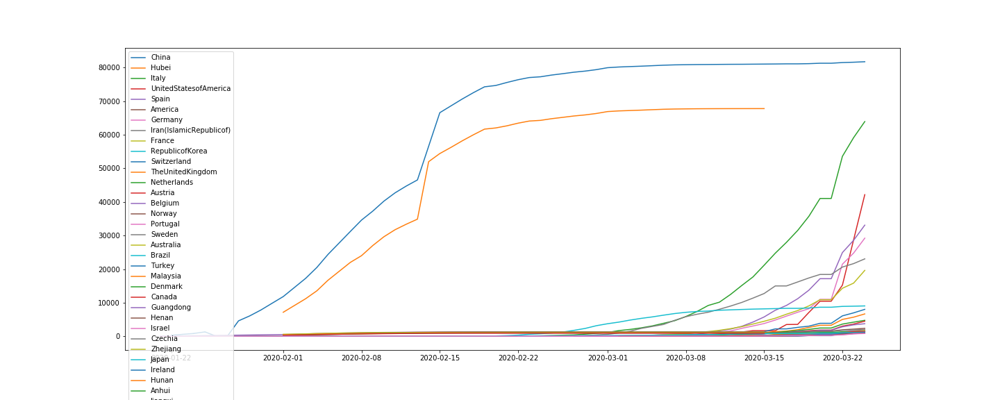
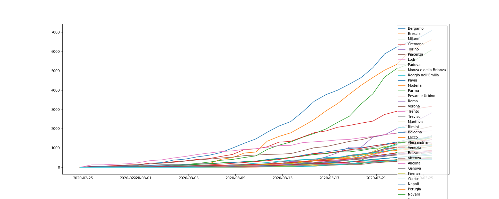
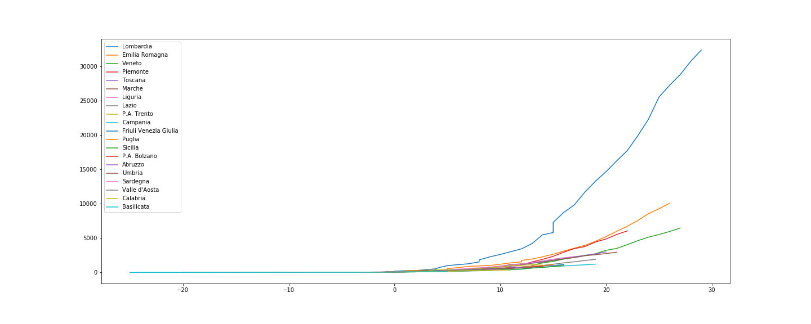
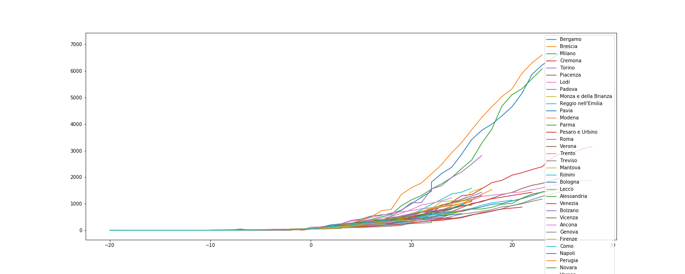

# Coronavirus Cases Analysis

Analysis related to the current outbreak of coronavirus disease (COVID-19). It was first reported from Wuhan, China, on 31 December 2019 and it was declared a Public Health Emergency of International Concern on 30 January 2020.

## Introduction

Let's try to get some numbers and analyze what is going on:
 - gather data from [WHO](https://www.who.int/emergencies/diseases/novel-coronavirus-2019/situation-reports/)
    - get daily situation report
    - parse pdf content in order to extract data from pdf report
 - gather data from [Protezione Civile Italian National Service](https://github.com/pcm-dpc/COVID-19)
    - download csv report with daily situation at 18:00 for each Italian region and also province detail
 - Compute statistics
 - Visual analysis by plotting data using charts and maps
   - Distribution of COVID-19 cases worldwide and for each country
   - Epidemiological curve worldwide and for each country

## Analysis

Here it is a graph with the epidemiological curve for different countries:

Here it is a graph with the epidemiological curve for different countries (China excluded):

Let's compare trend among different countries; so get date for each country in wich began 50 or more cases and consider it day 0:

Here there is the [data table](./casesByCountry.csv) related to the graph.

Here it is a graph with the epidemiological curve for the italian regions and italian provinces with most cases:

Here it is the comparison of the trend among italian regions and provinces, as before for each of them it is consider day 0 the day in which began 50 or more cases:

There is a main program to get the data and a jupyter-notebook to analyze it

## How to work with it

There is a main program to download the raw data and to parse it and a jupyter notebook in order to make the analysis.

### Main program

Take the data from web site of [World Health Organization](https://www.who.int/).
They published different situation report daily, there is a page with the links to each situation report that is a pdf file.
Extract the data from the pdf file considering that there are different kind of structures they used.
You can execute the program many times and it saves intermediary results in order to performe computations only for data of new situation reports.

### Jupyter-notebook

Load the dataframe with csv data.
Clean the data, convert types and format in order to use proper values.
Get the "countries" with the maximum number of cases.
Visualize the graphps of the cases in the countries day by day.
Compare epidemiological curves of the countries.

