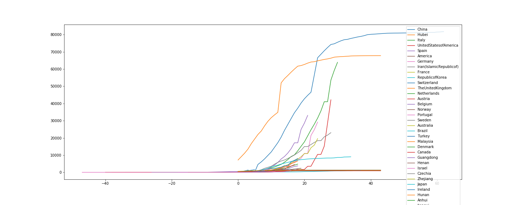

# Coronavirus Cases Analysis

Analysis related to the current outbreak of coronavirus disease (COVID-19). It was first reported from Wuhan, China, on 31 December 2019 and it was declared a Public Health Emergency of International Concern on 30 January 2020.

Let's try to get some numbers and analyze what is going on:
 - gather data from [WHO](https://www.who.int/emergencies/diseases/novel-coronavirus-2019/situation-reports/)
   - get daily situation report
   - parse pdf content in order to extract data from pdf report
 - Compute statistics
 - Visual analysis by plotting data using charts and maps
   - Distribution of COVID-19 cases worldwide and for each country
   - Epidemiological curve worldwide and for each country

Here it is a graph with the epidemiological curve for different countries (Hubei excluded):

Here it is a graph with the epidemiological curve for different countries (Hubei excluded):

Let's compare trend among differenc countries; so get date for each country in wich began 50 or more cases and consider it day 0:

Here there is the [data table](./casesByCountry.csv) related to the graph.